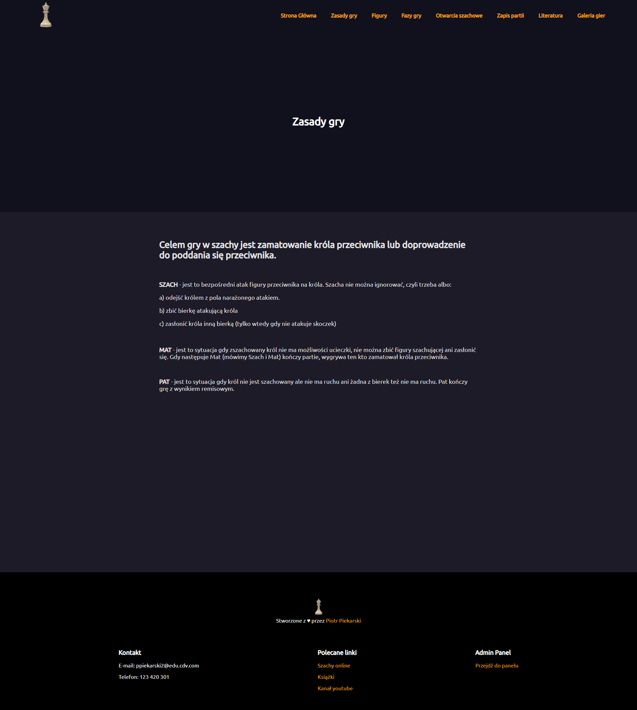
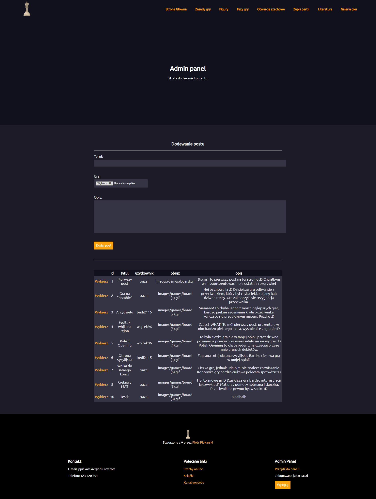

# ♟ Chess-website
Website about chess with secure pages and gallery of games.

## 🔍 Table of contents
* [General info](#-general-info)
* [Technologies](#-technologies)
* [Features](#-features)
* [Photos](#-photos)

## 📝 General info
This website was build for one of my projects at [Collegium Da Vinci][cdv]. This is my firts meet with C# and ASP.NET Framework.
	
## 🛠 Technologies
Project is created with **HTML, CSS, C#**.

🖼 Framework:
* [ASP.NET](https://dotnet.microsoft.com/apps/aspnet)

## 💡 Features
* Login into secure page (Admin Panel)
* Adding and editing posts

## 📸 Photos

### One of the content pages

 
### Admin panel page

 

[cdv]: https://cdv.pl/
